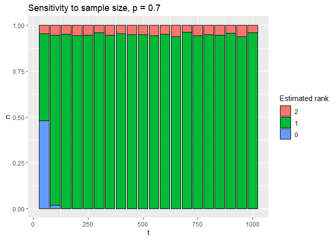
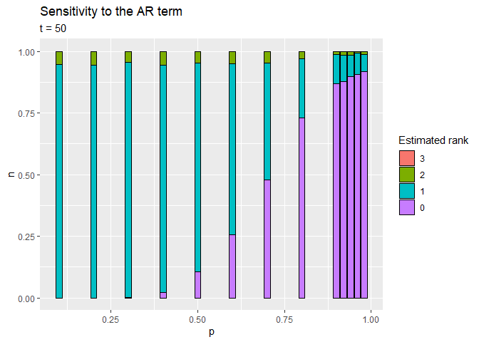
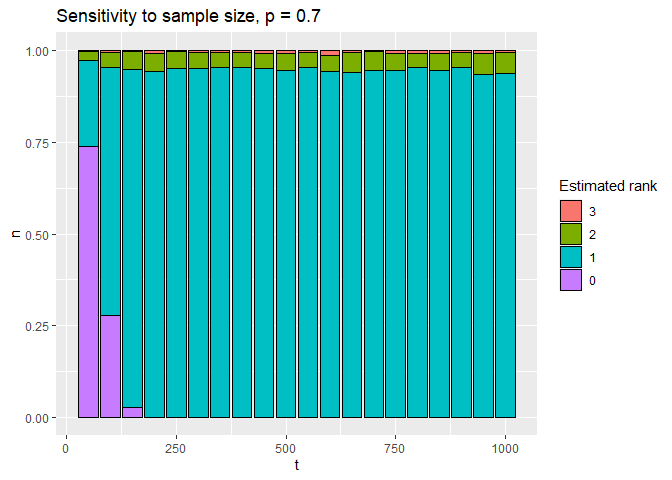
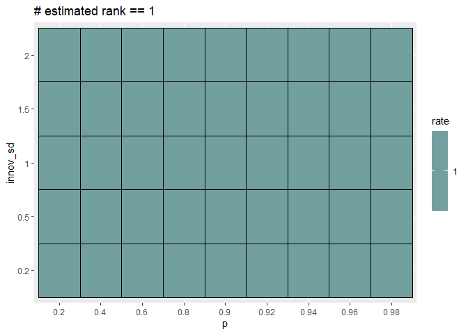

Simulation
================
Marcell P. Granat

## Functions

``` r
library(tidyverse)
library(tsDyn)

simulate_trivariate_1ci <- function(t = 250, p = .75, innov_sd = .5) {
  # Simulated trivariate cointegrated system with 1 cointegrating vector
  y2 <- cumsum(rnorm(t, 0, innov_sd))
  y3 <- cumsum(rnorm(t, 0, innov_sd))
  y1 <- .5*y2 + .5*y3 + arima.sim(list(ar= p), innov = rnorm(t, 0, innov_sd), n = t)
  tibble(x = y1, y = y2, z = y3)
}

simulate_trivariate_2ci <- function(t = 250, p = .75, innov_sd = .5) {
  # Simulated trivariate cointegrated system with 2 cointegrating vectors
  y3 <- cumsum(rnorm(t, 0, innov_sd))
  y1 <- y3 + arima.sim(list(ar= p), innov = rnorm(t, 0, innov_sd), n = t)
  y2 <- y3 + arima.sim(list(ar= p), innov = rnorm(t, 0, innov_sd), n = t)
  tibble(x = y1, y = y2, z = y3)
}
```

## One ci

``` r
df <- expand.grid(
  t = 1:20 * 50,
   p = c(1:9 / 10, .92, .94, .96, .98),
  rank = 1:10 # number of iterations
) 
```

``` r
set.seed(2021)

for (i in 1:100) { # not enough memory >> perform iteratively w loop
  row_n <- 1:nrow(df)
  row_n <- row_n[cut(row_n, 100, FALSE) == i]
  
  df[row_n, ] <- df[row_n, ] %>% 
    select(t, p) %>% 
    mutate(
      dgp = map2(t, p, ~ simulate_trivariate_1ci(t = .x, p = .y)),
      model = map(dgp, ~ VECM(data = ., lag = 0, estim = "ML", include = "none")),
      rank = map_dbl(model, ~ rank.test(vecm = ., type = 'trace', cval = 0.05)$r),
    ) %>% 
    select(t, p, rank)
}
```

``` r
df %>% 
  filter(p == .7) %>% 
  count(t, rank) %>% 
  group_by(t) %>% 
  group_modify(~ mutate(.x, n = n / sum(n))) %>% 
  ungroup() %>% 
  mutate(
    rank = factor(rank, levels = as.character(3:0))
  ) %>% 
  ggplot(aes(t, n, fill = factor(rank))) + 
  geom_col(color = "black") + 
  labs(title = "Sensitivity to sample size, p = 0.7", fill = "Estimated rank")
```

<!-- -->

``` r
walk(
  1:9 / 10,
  ~ {p <- filter(df, p == .) %>% 
    count(t, rank) %>% 
    group_by(t) %>% 
    group_modify(~ mutate(.x, n = n / sum(n))) %>% 
    ungroup() %>% 
    mutate(
      rank = factor(rank, levels = as.character(3:0))
    ) %>% 
    ggplot(aes(t, n, fill = rank)) + 
    geom_col(color = "black") + 
    scale_fill_discrete(drop = FALSE) +
    labs(title = "Sensitivity to sample size", subtitle = str_c("p = ", .), fill = "Estimated rank")
  print(p)  
  }
)
```

<!-- -->

``` r
walk(
  1:20 * 50,
  ~ {p <- filter(df, t == .) %>% 
    count(p, rank) %>% 
    group_by(p) %>% 
    group_modify(~ mutate(.x, n = n / sum(n))) %>% 
    ungroup() %>% 
    mutate(
      rank = factor(rank, levels = as.character(3:0))
    ) %>% 
    ggplot(aes(p, n, fill = rank)) + 
    geom_col(color = "black") + 
    scale_fill_discrete(drop = FALSE) +
    labs(title = "Sensitivity to sample size", subtitle = str_c("t = ", .), fill = "Estimated rank")
  print(p)  
  }
)
```

<!-- -->

``` r
df %>% 
  count(t, p, rank) %>% 
  group_by(t, p) %>% 
  group_modify(~ mutate(.x, n = n / sum(n))) %>% 
  ungroup() %>% 
  filter(rank == 1) %>% 
  ggplot() + 
  aes(t, p, fill = n) + 
  geom_tile(color = "black") + 
  scale_fill_gradient(low = "grey70", high = "cyan4") + 
  labs(title = "# estimated rank == 1", fill = "rate")
```

<!-- -->

### Effect of variance

#### sd vs. t

``` r
df <- expand.grid(
  t = 1:20 * 50,
  innov_sd = c(.2, .5, 1, 1.5, 2),
  rank = 1:10 # number of iterations
) 
```

``` r
set.seed(2021)

for (i in 1:100) { # not enough memory >> perform iteratively w loop
  row_n <- 1:nrow(df)
  row_n <- row_n[cut(row_n, 100, FALSE) == i]
  
  df[row_n, ] <- df %>% 
    .[row_n, ] %>% 
    mutate(
      dgp = map2(t, innov_sd, ~ simulate_trivariate_1ci(t = .x, innov_sd = .y)),
      model = map(dgp, ~ VECM(data = ., lag = 0, estim = "ML", include = "none")),
      rank = map_dbl(model, ~ rank.test(vecm = ., type = 'trace', cval = 0.05)$r),
    ) %>% 
    select(t, innov_sd, rank)
}
```

``` r
df %>% 
  filter(t == 200) %>% 
  count(innov_sd, rank) %>% 
  group_by(innov_sd) %>% 
  group_modify(~ mutate(.x, n = n / sum(n))) %>% 
  ungroup() %>% 
  mutate(
    rank = factor(rank, levels = as.character(3:0))
  ) %>% 
  ggplot(aes(innov_sd, n, fill = factor(rank))) + 
  geom_col(color = "black") + 
  labs(title = "Sensitivity to sample size, t = 200", fill = "Estimated rank")
```

<!-- -->

``` r
walk(
  1:20 * 50,
  ~ {p <- df %>% 
    filter(t == .) %>% 
    count(innov_sd, rank) %>% 
    group_by(innov_sd) %>% 
    group_modify(~ mutate(.x, n = n / sum(n))) %>% 
    ungroup() %>% 
    mutate(
      rank = factor(rank, levels = as.character(3:0))
    ) %>% 
    ggplot(aes(innov_sd, n, fill = factor(rank))) + 
    geom_col(color = "black") + 
  labs(title = "Sensitivity to sample size", subtitle = str_c("t = ", .), fill = "Estimated rank")
  print(p)
  }
)
```

<!-- -->

#### sd vs. p

``` r
df <- expand.grid(
  p = c(1:4 / 5, .9, .92, .94, .96, .98),
  innov_sd = c(.2, .5, 1, 1.5, 2),
  rank = 1:10 # number of iterations
) 
```

``` r
set.seed(2021)

for (i in 1:100) { # not enough memory >> perform iteratively w loop
  row_n <- 1:nrow(df)
  row_n <- row_n[cut(row_n, 100, FALSE) == i]
  
  df[row_n, ] <- df %>% 
    .[row_n, ] %>% 
    mutate(
      dgp = map2(p, innov_sd, ~ simulate_trivariate_1ci(p = .x, innov_sd = .y)),
      model = map(dgp, ~ VECM(data = ., lag = 0, estim = "ML", include = "none")),
      rank = map_dbl(model, ~ rank.test(vecm = ., type = 'trace', cval = 0.05)$r),
    ) %>% 
    select(p, innov_sd, rank)
}
```

``` r
df %>% 
  count(p, innov_sd, rank) %>% 
  group_by(p, innov_sd, rank) %>% 
  group_modify(~ mutate(.x, n = n / sum(n))) %>% 
  ungroup() %>% 
  mutate_at(1:2, as.factor) %>% 
  filter(rank == 1) %>% 
  ggplot() + 
  aes(p, innov_sd, fill = n) + 
  geom_tile(color = "black") + 
  scale_fill_gradient(low = "grey70", high = "cyan4") + 
  labs(title = "# estimated rank == 1", fill = "rate")
```

<!-- -->

## Two ci

### Effect of AR term

``` r
df <- expand.grid(
  t = 1:20 * 50,
  p = c(1:9 / 10, .92, .94, .96, .98),
  rank = 1:10 # number of iterations
) 
```

``` r
set.seed(2021)

for (i in 1:100) { # not enough memory >> perform iteratively w loop
  row_n <- 1:nrow(df)
  row_n <- row_n[cut(row_n, 100, FALSE) == i]
  
  df[row_n, ] <- df[row_n, ] %>% 
    select(t, p) %>% 
    mutate(
      dgp = map2(t, p, ~ simulate_trivariate_2ci(t = .x, p = .y)),
      model = map(dgp, ~ VECM(data = ., lag = 0, estim = "ML", include = "none")),
      rank = map_dbl(model, ~ rank.test(vecm = ., type = 'trace', cval = 0.05)$r),
    ) %>% 
    select(t, p, rank)
}
```

``` r
df %>% 
  filter(p == .7) %>% 
  count(t, rank) %>% 
  group_by(t) %>% 
  group_modify(~ mutate(.x, n = n / sum(n))) %>% 
  ungroup() %>% 
  mutate(
    rank = factor(rank, levels = as.character(3:0))
  ) %>% 
  ggplot(aes(t, n, fill = factor(rank))) + 
  geom_col(color = "black") + 
  labs(title = "Sensitivity to sample size, p = 0.7", fill = "Estimated rank")
```

<!-- -->

``` r
walk(
  c(1:9 / 10, .92, .94, .96, .98),
  ~ {p <- filter(df, p == .) %>% 
    count(t, rank) %>% 
    group_by(t) %>% 
    group_modify(~ mutate(.x, n = n / sum(n))) %>% 
    ungroup() %>% 
    mutate(
      rank = factor(rank, levels = as.character(3:0))
    ) %>% 
    ggplot(aes(t, n, fill = rank)) + 
    geom_col(color = "black") + 
    scale_fill_discrete(drop = FALSE) +
    labs(title = "Sensitivity to sample size", subtitle = str_c("p = ", .), fill = "Estimated rank")
  print(p)  
  }
)
```

<!-- -->

``` r
walk(
  1:20 * 50,
  ~ {p <- filter(df, t == .) %>% 
    count(p, rank) %>% 
    group_by(p) %>% 
    group_modify(~ mutate(.x, n = n / sum(n))) %>% 
    ungroup() %>% 
    mutate(
      rank = factor(rank, levels = as.character(3:0))
    ) %>% 
    ggplot(aes(p, n, fill = rank)) + 
    geom_col(color = "black") + 
    scale_fill_discrete(drop = FALSE) +
    labs(title = "Sensitivity to sample size", subtitle = str_c("t = ", .), fill = "Estimated rank")
  print(p)  
  }
)
```

<!-- -->

``` r
df %>% 
  count(t, p, rank) %>% 
  group_by(t, p) %>% 
  group_modify(~ mutate(.x, n = n / sum(n))) %>% 
  ungroup() %>% 
  filter(rank == 2) %>% 
  ggplot() + 
  aes(t, p, fill = n) + 
  geom_tile(color = "black") + 
  scale_fill_gradient(low = "grey70", high = "cyan4") + 
  labs(title = "# estimated rank == 2", fill = "rate")
```

<!-- -->

### Effect of variance

#### sd vs. t

``` r
df <- expand.grid(
  t = 1:20 * 50,
  innov_sd = c(.2, .5, 1, 1.5, 2),
  rank = 1:10 # number of iterations
) 
```

``` r
set.seed(2021)

for (i in 1:100) { # not enough memory >> perform iteratively w loop
  row_n <- 1:nrow(df)
  row_n <- row_n[cut(row_n, 100, FALSE) == i]
  
  df[row_n, ] <- df %>% 
    .[row_n, ] %>% 
    mutate(
      dgp = map2(t, innov_sd, ~ simulate_trivariate_1ci(t = .x, innov_sd = .y)),
      model = map(dgp, ~ VECM(data = ., lag = 0, estim = "ML", include = "none")),
      rank = map_dbl(model, ~ rank.test(vecm = ., type = 'trace', cval = 0.05)$r),
    ) %>% 
    select(t, innov_sd, rank)
}
```

``` r
df %>% 
  filter(t == 200) %>% 
  count(innov_sd, rank) %>% 
  group_by(innov_sd) %>% 
  group_modify(~ mutate(.x, n = n / sum(n))) %>% 
  ungroup() %>% 
  mutate(
    rank = factor(rank, levels = as.character(3:0))
  ) %>% 
  ggplot(aes(innov_sd, n, fill = factor(rank))) + 
  geom_col(color = "black") + 
  labs(title = "Sensitivity to sample size, t = 200", fill = "Estimated rank")
```

<!-- -->

``` r
walk(
  1:20 * 50,
  ~ {p <- df %>% 
    filter(t == .) %>% 
    count(innov_sd, rank) %>% 
    group_by(innov_sd) %>% 
    group_modify(~ mutate(.x, n = n / sum(n))) %>% 
    ungroup() %>% 
    mutate(
      rank = factor(rank, levels = as.character(3:0))
    ) %>% 
    ggplot(aes(innov_sd, n, fill = factor(rank))) + 
    geom_col(color = "black") + 
  labs(title = "Sensitivity to sample size", subtitle = str_c("t = ", .), fill = "Estimated rank")
  print(p)
  }
)
```

<!-- -->

#### sd vs. p

``` r
df <- expand.grid(
  p = c(1:4 / 5, .9, .92, .94, .96, .98),
  innov_sd = c(.2, .5, 1, 1.5, 2),
  rank = 1:10 # number of iterations
) 
```

``` r
set.seed(2021)

for (i in 1:100) { # not enough memory >> perform iteratively w loop
  row_n <- 1:nrow(df)
  row_n <- row_n[cut(row_n, 100, FALSE) == i]
  
  df[row_n, ] <- df %>% 
    .[row_n, ] %>% 
    mutate(
      dgp = map2(p, innov_sd, ~ simulate_trivariate_2ci(p = .x, innov_sd = .y)),
      model = map(dgp, ~ VECM(data = ., lag = 0, estim = "ML", include = "none")),
      rank = map_dbl(model, ~ rank.test(vecm = ., type = 'trace', cval = 0.05)$r),
    ) %>% 
    select(p, innov_sd, rank)
}
```

``` r
df %>% 
  count(p, innov_sd, rank) %>% 
  group_by(p, innov_sd, rank) %>% 
  group_modify(~ mutate(.x, n = n / sum(n))) %>% 
  ungroup() %>% 
  mutate_at(1:2, as.factor) %>% 
  filter(rank == 2) %>% # TODO 1?
  ggplot() + 
  aes(p, innov_sd, fill = n) + 
  geom_tile(color = "black") + 
  scale_fill_gradient(low = "grey70", high = "cyan4") + 
  labs(title = "# estimated rank == 2", fill = "rate")
```

<!-- -->
